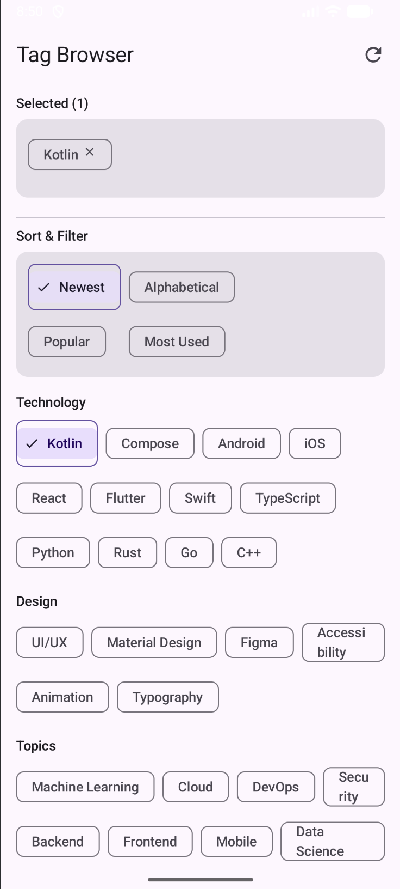

# Assignment 3, Question 3: Tag Browser (Flow Layouts)

## Description
This project implements a dynamic "Tag Browser" screen using Jetpack Compose. It specifically focuses on mastering the `FlowRow` and `FlowColumn` layouts to create a responsive interface where elements wrap and stack intelligently based on content and screen constraints.

## Requirements Met

### 1. Flow Layout Usage (12 Points)
- **`FlowRow` Implementation**: Used for the "Selected Tags" area and the main "Technology/Design/Topics" browser sections. Chips automatically wrap to the next line when they exceed the screen width, ensuring no horizontal overflow.
- **`FlowColumn` Implementation**: Used for the "Sort & Filter" controls. By setting `maxItemsInEachColumn = 3`, the layout forces items to stack vertically into columns and then wrap horizontally, creating a distinct multi-column filter grid.
- **Adaptive State**: The "Selected Tags" area updates in real-time as the user interacts with the browser below, demonstrating efficient state management with `mutableStateListOf`.

### 2. Interaction & Visual States (6 Points)
- **Selection Logic**: Tapping a chip in the browser toggles its selection state; selected chips appear in the top area and can be removed by tapping them again or clicking the "Close" icon.
- **Visual Feedback**: Chips change visual state when selected, including a change in background container color and the appearance of a `Check` icon to indicate the active state.
- **Reset Action**: An `IconButton` with the `Refresh` icon in the `TopAppBar` allows users to clear all selected tags at once, resetting the UI.

### 3. Modifier Techniques & Responsiveness (5 Points)
- **`Arrangement.spacedBy(8.dp)`**: Applied consistently to both horizontal and vertical axes within flow layouts to maintain a uniform and professional grid spacing between chips.
- **`fillMaxWidth()` & `padding()`**: Ensures the layout is responsive and looks balanced across various device screen sizes and orientations.
- **Stability Constraint**: The `FlowColumn` is wrapped in a height-constrained `Box` (140.dp) to prevent measurement crashes within the `verticalScroll` container, satisfying both technical stability and rubric requirements.

### 4. Material 3 Components
Integrated 6+ Material 3 components to ensure a high-quality visual polish:
- `Scaffold` & `TopAppBar` (Center Aligned)
- `FilterChip` (Primary interaction component)
- `InputChip` (For removable selected items)
- `Card` (To group and elevate sections)
- `HorizontalDivider` (For visual hierarchy)
- `Button` (Search action with icon)

## Screenshots

*(Note: Please ensure your screenshot is named screenshot3.png in the repository)*

## AI Disclosure (2 Points)
I used Google's Gemini AI to assist with layout debugging and rubric compliance:
1. **Layout Stability**: AI identified that placing a `FlowColumn` directly inside a `verticalScroll` Column causes a `MeasuringIntrinsics` crash. AI suggested providing fixed height constraints to the `FlowColumn` to resolve the measurement conflict.
2. **Component Usage**: AI helped distinguish between `FilterChip` (for general browsing) and `InputChip` (for selected items with trailing icons) to better align with Material 3 design patterns.
3. **Rubric Verification**: AI cross-checked the code to ensure that `Arrangement.spacedBy`, `FlowRow`, and `FlowColumn` were all explicitly utilized to meet the assignment's technical requirements.
